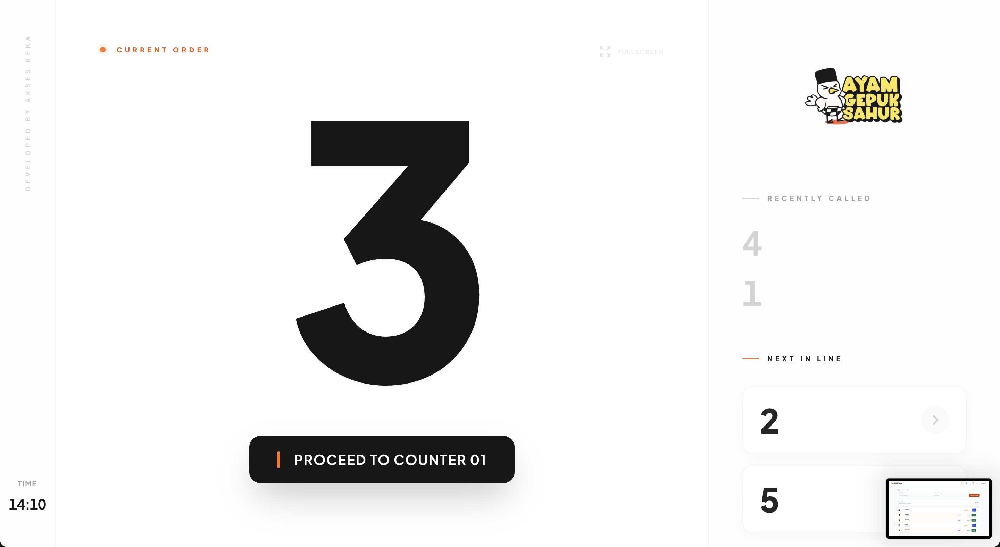
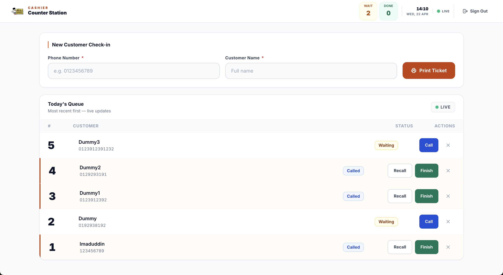
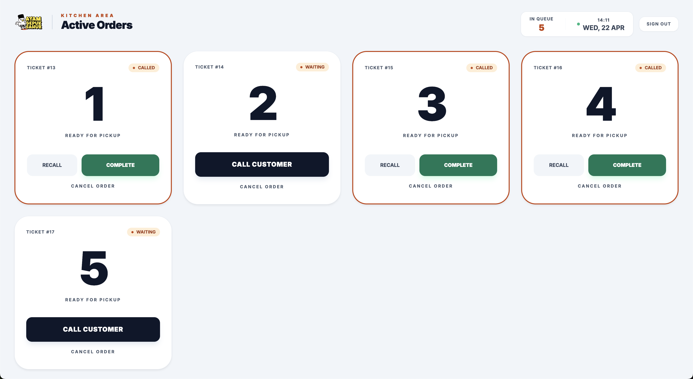
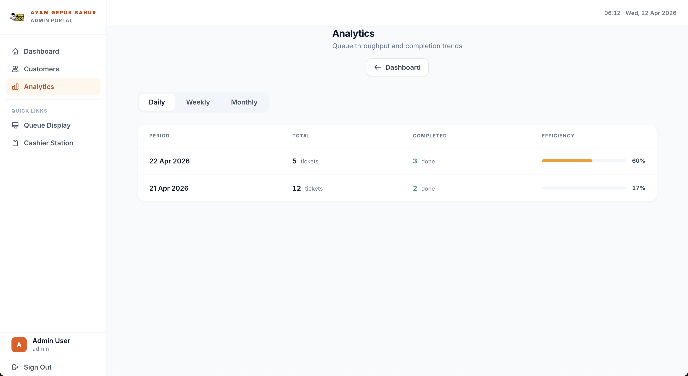

# AyamGepukSahur Queue System

> Real-time restaurant queue management system for Ayam Gepuk Sahur.

**Live**: [aksesqueue.ayamgepuksahur.com](https://aksesqueue.ayamgepuksahur.com)

---

## Overview

A real-time queue management system built for a busy restaurant. Customers take a queue number at the cashier, the kitchen processes orders, and a TV display board shows the called numbers — all synced live via WebSockets with zero page refresh.

Built on Laravel 12 + Pusher, deployed on Hostinger shared hosting.

---

## Key Features

### Real-Time WebSockets
- Live queue updates pushed instantly to all connected screens via Pusher
- `ShouldBroadcastNow` for zero-delay broadcasting (critical on shared hosting — no queue worker delay)
- WebSocket disconnect indicator shown when connection drops
- Events: `queue.updated` and `number.called` on `queue-updates` channel

### Role-Based Dashboards
- **Cashier** — issue queue numbers, call next customer, clear view between orders
- **Kitchen** — card-based active orders view, call customer or mark complete per ticket
- **TV Display** — fullscreen board showing current number with recently called + next in line sidebar
- **Admin** — customer log, analytics with daily/weekly/monthly efficiency tracking

### Admin Analytics
- Color-coded efficiency progress bar (amber ≥50%, green ≥80%, red below)
- Daily, weekly, monthly period switcher
- Total tickets vs completed breakdown per period

### Security & Quality
- XSS protection on all outputs
- `lockForUpdate` on queue number issuance (prevents race conditions under load)
- `today()` scope on all queries (no stale data across midnight)
- State guards on all queue transitions
- 45 feature tests passing

### Accessibility
- WCAG 2.1 AA compliant across all pages
- Skip links, `aria-live` regions, `aria-progressbar`, focus rings on all interactive elements
- 44px minimum touch targets on mobile
- Responsive CSS Grid (2-col mobile → 4-col desktop)

---

## Tech Stack

| Layer | Technology |
|-------|-----------|
| Backend | Laravel 12, PHP 8.3 |
| Frontend | Blade + Tailwind CSS |
| Real-Time | Pusher WebSockets (cluster ap1) |
| Database | MySQL 8 |
| Testing | PHPUnit — 45 feature tests |

---

## Screenshots

### TV Display Board

### Cashier Counter Station

### Kitchen Active Orders

### Admin Analytics

---

## Source Code

This repository is **private**. The source code is available on request for potential employers or collaborators.

Contact: [aksesreka@gmail.com](mailto:aksesreka@gmail.com)
